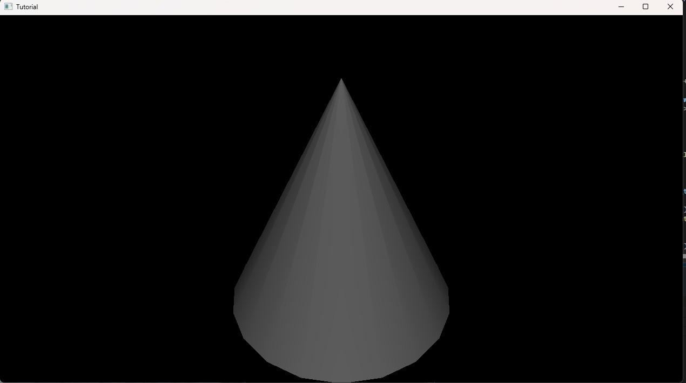
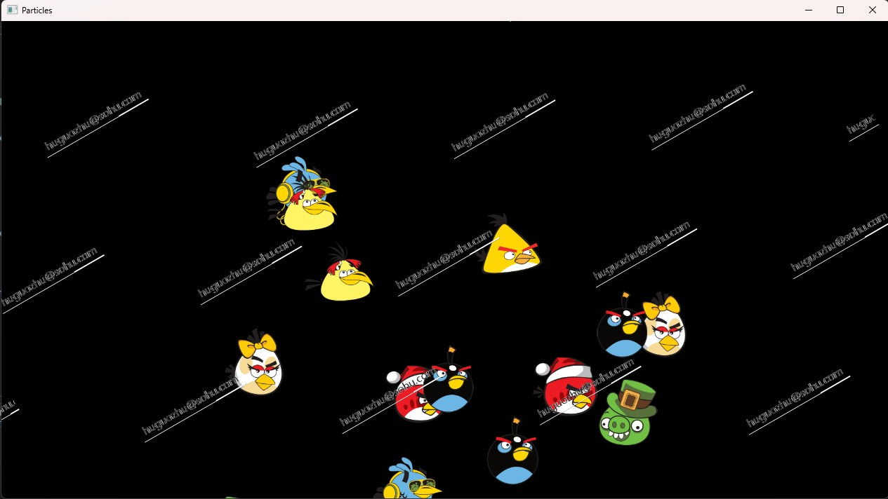
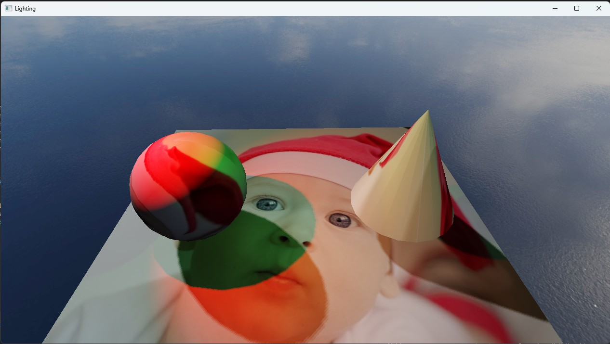
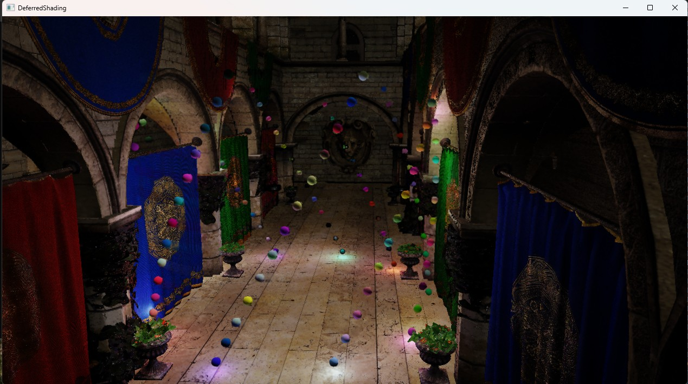
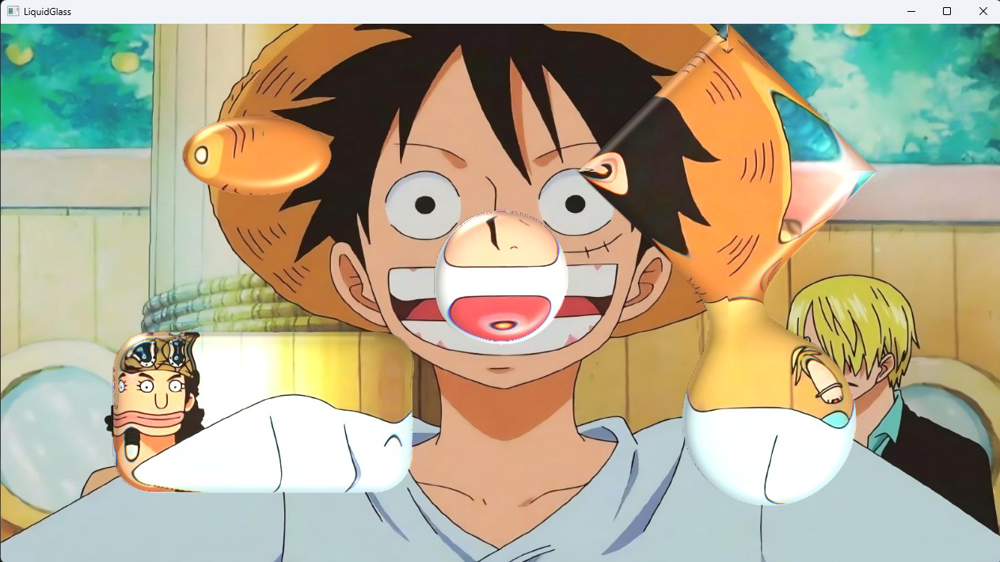

# SeekEngine

Sample1:Tutorial--Camera & Shape Component to render scene

  

Sample2:Particle--Use Particle & WaterMark Components

  

Sample4:Lighting--Skybox & Shadows

  

Sample5:DeferredShaindg-- Deferred Shaing of glTFv2.0 Mesh & Many(100+) Lights

  

Sample7: Use Liquid Glass Components(Use SDF) & 2D PBR Lighting

  

