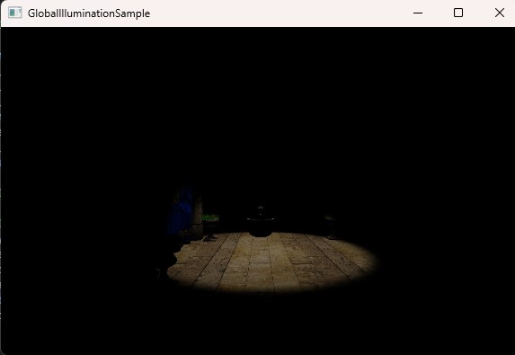
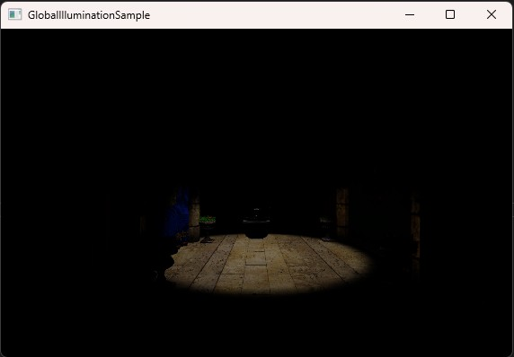
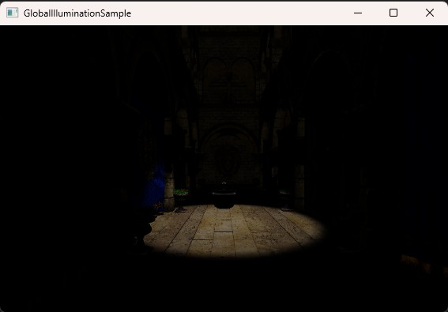

SeekEngine 渲染引擎综合介绍
1. 核心架构与设计哲学
- 状态机驱动的渲染硬件接口（State Machine RHI）：这是引擎的核心设计。它将图形API（如Direct3D 11和OpenGL）的调用抽象并封装为一套统一的状态和命令集。
- 实体组件系统（Entity-Component）：引擎采用现代游戏引擎流行的ECS架构。游戏中的每个对象都是一个仅包含ID的“实体（Entity）”，其具体功能（如渲染、位移、物理）由可添加或移除的“组件（Component）”数据块构成。
2. 核心特性
- 多图形API支持：通过其RHI层，原生支持 Direct3D 11 和 OpenGL，可以无缝部署在Windows平台和兼容OpenGL的各种平台（如Linux、macOS）上。
- 基于GPU的粒子系统：这是引擎的一个高级特性。与传统CPU计算粒子运动不同，它将粒子数据（位置、速度等）存储在GPU显存中，并利用着色器（特别是计算着色器或顶点着色器）进行并行计算。这能实现数以百万计的复杂粒子效果（如烟雾、火焰、魔法），且几乎不消耗CPU资源，视觉效果和性能极佳。
- 现代渲染管线支持：前向渲染、延迟渲染等现代渲染管线，以及PBR（基于物理的渲染）材质流程。
- 支持RSM & LPV & VXGI等全局光照技术。
- 支持TAA/FXAA等抗锯齿。
- 基于hlsl着色器，通过Shader Conductor翻译成glsl和metal着色器语言。
3. 潜在的技术栈与适用场景
- 编程语言：核心引擎很可能使用 C/C++ 编写以保证高性能。
- 目标平台：主要面向 Windows平台。
- 适用项目：非常适合作为学习现代渲染引擎架构、计算机图形学以及ECS设计模式的范本。

Sample1:Tutorial--Camera & Shape Component to render scene

  

Sample2:Particle--Use Particle & WaterMark Components

  

Sample4:Lighting--Skybox & Shadows

  

Sample5:DeferredShaindg--Deferred Shaing of glTFv2.0 Mesh & Many(100+) Lights

  

Sample6:Global Illumination-- No_GI

  

 GI--RSM

  

GI--LPV

  

Sample7: Use Liquid Glass Components(Use SDF) & 2D PBR Lighting

  

